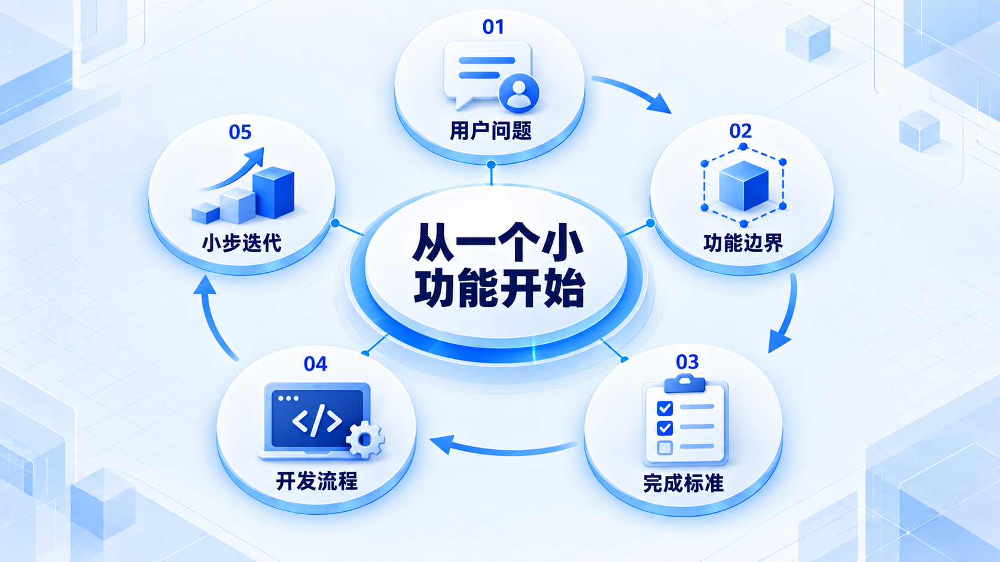
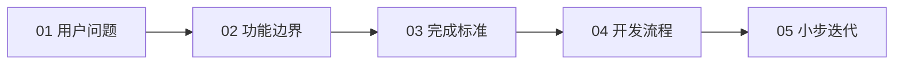

# 从一个小功能开始

先看一个按钮背后还需要哪些工作，再把任务拆成能验证的小步；写出代码只是交付过程的一部分。

## 学习路线

箭头表示本章概念的推荐学习顺序，不表示实际系统只允许单向运行。框架与方案对照中的选项可以按项目需要选择。

## 本章核心模块

1. **用户问题**
2. **功能边界**
3. **完成标准**
4. **开发流程**
5. **小步迭代**

## 按课程顺序阅读

1. [软件工程到底在解决什么：从一个收藏按钮开始](<../../content/软件工程/01-从一个小功能开始/01-软件工程到底在解决什么.md>) · 文章
2. [开发流程与小步迭代：为什么不要憋到最后一天](<../../content/软件工程/01-从一个小功能开始/02-开发流程与小步迭代.md>) · 文章

[返回全部章节](README.md)
