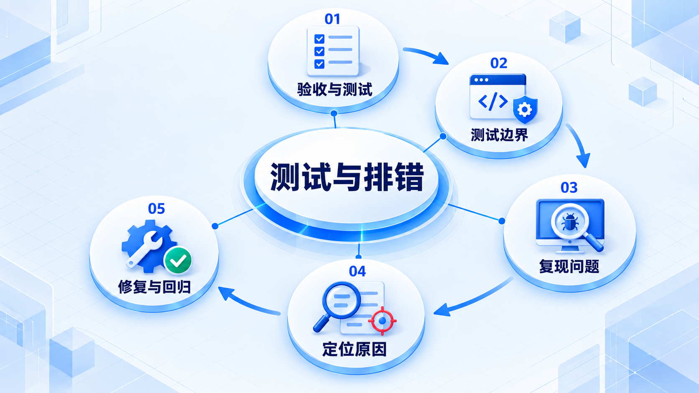

# 测试与排错

从输入和预期结果开始写测试；遇到错误时先稳定复现，再缩小范围，最后用回归测试防止重现。

## 学习路线

箭头表示本章概念的推荐学习顺序，不表示实际系统只允许单向运行。框架与方案对照中的选项可以按项目需要选择。

## 本章核心模块

1. **验收与测试**
2. **测试边界**
3. **复现问题**
4. **定位原因**
5. **修复与回归**

## 按课程顺序阅读

1. [从验收例子到自动化测试：怎样知道没有改坏](<../../content/软件工程/05-测试与排错/01-从验收例子到自动化测试.md>) · 文章
2. [调试、缺陷与回归验证：从“好像坏了”走到证据](<../../content/软件工程/05-测试与排错/02-调试缺陷与回归验证.md>) · 文章

[返回全部章节](README.md)
