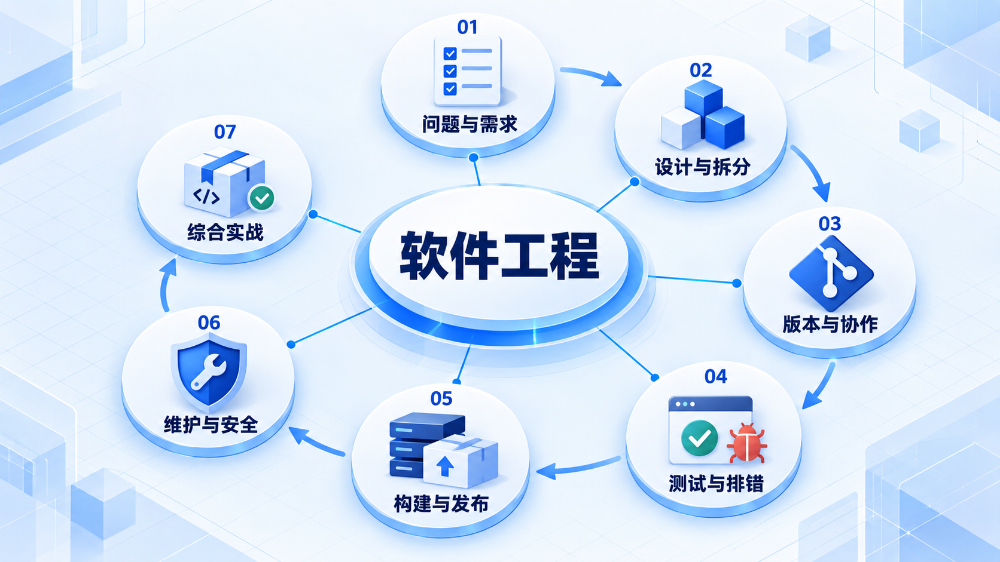
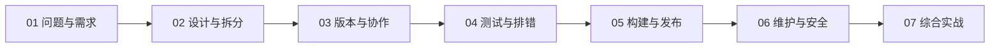

# 软件工程

从一个收藏功能出发，先说清用户问题和验收标准，再完成设计、协作、验证与交付；实际开发可以反复返回前面的步骤。

## 学习路线

箭头表示本章概念的推荐学习顺序，不表示实际系统只允许单向运行。框架与方案对照中的选项可以按项目需要选择。

## 本章核心模块

1. **问题与需求**
2. **设计与拆分**
3. **版本与协作**
4. **测试与排错**
5. **构建与发布**
6. **维护与安全**
7. **综合实战**

## 按课程顺序阅读

1. [软件工程学习路线：把一个小功能从想法做到可靠交付](<../../content/软件工程/00-软件工程学习路线.md>) · 文章
2. [从一个小功能开始](<se-small-feature.md>) · 章节
3. [把需求说清楚](<se-requirements.md>) · 章节
4. [设计与拆分](<se-design.md>) · 章节
5. [版本管理与协作](<se-git.md>) · 章节
6. [测试与排错](<se-testing.md>) · 章节
7. [构建发布与运行](<se-delivery.md>) · 章节
8. [维护安全与改进](<se-maintenance.md>) · 章节
9. [软件工程综合实战](<se-practice.md>) · 章节
10. [软件工程推荐阅读：遇到问题再找对应资料](<../../content/软件工程/99-软件工程推荐阅读.md>) · 文章

[返回全部章节](README.md)
